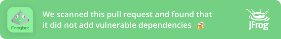
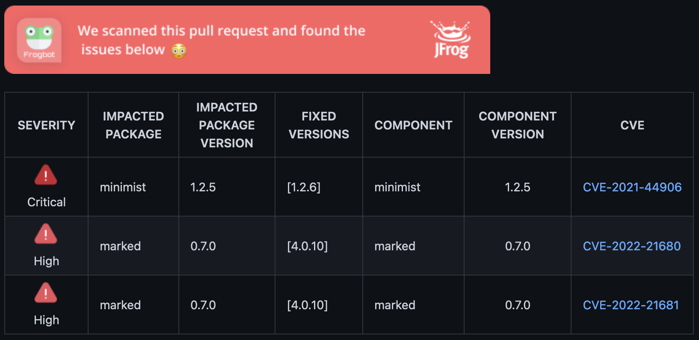

# Frogbot

## Project Status

[](https://github.com/jfrog/frogbot/actions/workflows/test.yml) [](https://github.com/jfrog/frogbot/actions/workflows/action-test.yml)
[](https://coveralls.io/github/jfrog/frogbot?branch=dev)

## 🤖 What is Frogbot?

Frogbot is a Git bot that scans your pull requests with JFrog Xray for security vulnerabilities. Frogbot can be easily triggered following the creation of a new pull request. Frogbot adds the scan results as a comment on the pull request. If no vulnerabilities are found, Frogbot will also add a comment, confirming this. Currently GitHub and GitLab are supported. Bitbucket will be supported soon.

## 🕵 How does it work?

After a new pull request is created, one of the maintainers can add the "Frogbot scan" label to the pull request. Frogbot will then be triggered and the pull request will be scanned. The scan output will include only new vulnerabilities added by the pull request. Vulnerabilities that existed in the code prior to the pull request created will not be added to the report.

After the pull request scanning completed, Frogbot will automatically add a comment to the pull request.
If no vulnerabilities were added in the pull request:
[](#-how-does-it-work)

If one or more vulnerabilities were added in the pull request:
[](#-how-does-it-work)

## 🖥️ Usage

- [Using Frogbot with GitHub Actions](#using-frogbot-with-github-actions)
- [Using Frogbot with GitLab CI](#using-frogbot-with-gitlab-ci)

### Using Frogbot with GitHub Actions

For a super quick start, we created [GitHub Actions templates](templates/github-actions/README.md#github-actions-templates) under [templates/github-action](templates/github-actions/).

#### How does it work?

1. User opens a pull request
1. If missing, Frogbot creates a label `🐸 frogbot scan` in the repository
1. Maintainer reviewes the pull request and assigns `🐸 frogbot scan`
1. Frogbot gets triggered by the label, unlabels it, and executes the pull request scanning

Here's a recommanded structure of a `frogbot.yml` workflow file:

```yml
name: "Frogbot"
on:
  # After a pull request opened, Frogbot automatically creates the "🐸 frogbot scan" label if needed.
  # After "🐸 frogbot scan" label was added to a pull request, Frogbot scans the pull request.
  pull_request_target:
    types: [opened, labeled]
jobs:
  scan-pull-request:
    runs-on: ubuntu-latest
    steps:
      - uses: actions/checkout@v2
        with:
          ref: ${{ github.event.pull_request.head.sha }}

      # Install prerequisites - "setup-go", "setup-node", "setup-python", etc.
      # ...

      - uses: jfrog/frogbot@v1
        env:
          # [Mandatory] JFrog platform URL
          JF_URL: ${{ secrets.JF_URL }}

          # [Mandatory if JF_USER and JF_PASSWORD are not provided] JFrog access token with 'read' permissions on Xray service
          JF_ACCESS_TOKEN: ${{ secrets.JF_ACCESS_TOKEN }}

          # [Mandatory if JF_ACCESS_TOKEN is not provided] JFrog platform username
          JF_USER: ${{ secrets.JF_USER }}

          # [Mandatory if JF_ACCESS_TOKEN is not provided] JFrog platform password
          JF_PASSWORD: ${{ secrets.JF_PASSWORD }}

          # [Mandatory] The GitHub token is automatically generated for the job
          JF_GIT_TOKEN: ${{ secrets.GITHUB_TOKEN }}

          # [Optional] Xray Watches. Learn more about them here: https://www.jfrog.com/confluence/display/JFROG/Configuring+Xray+Watches
          JF_WATCHES: <watch-1>,<watch-2>...<watch-n>

          # [Optional] JFrog project. Learn more about it here: https://www.jfrog.com/confluence/display/JFROG/Projects
          JF_PROJECT: <project-key>

          # [Optional] The command that installs the dependencies. For example - "npm i", "nuget restore", "dotnet restore", "pip install", etc.
          JF_INSTALL_DEPS_CMD: <your-install-command>
```

### Using Frogbot with GitLab CI

TODO

### Download Frogbot Manually

Download Frogbot using the following command:

```bash
curl -fLg "https://releases.jfrog.io/artifactory/frogbot/v1/[RELEASE]/getFrogbot.sh" | sh
```

<details>
<summary>Download Frogbot through Artifactory</summary>

If your agent has no internet access, you can configure the pipeline to download Frogbot and from a JFrog Artifactory instance, which is configured to proxy the download repositories.

1. Create a remote repository in Artifactory for downloading Frogbot. Name the repository frogbot and set its URL to https://releases.jfrog.io/artifactory/frogbot/v1/
2. Depends on your agent's architecture and operating system, download Frogbot using curl:

```bash
curl -fLg "https://acme.jfrog.io/artifactory/frogbot/[RELEASE]/<arch>/frogbot" -H "Authorization: Bearer $JF_ACCESS_TOKEN" -o frogbot
```

##### Available architechtures:

- frogbot-linux-386
- frogbot-linux-amd64
- frogbot-linux-arm
- frogbot-linux-arm64
- frogbot-linux-ppc64
- frogbot-linux-ppc64le
- frogbot-linux-s390x
- frogbot-mac-386
- frogbot-windows-amd64

For example:

```bash
curl -fLg "https://acme.jfrog.io/artifactory/frogbot/[RELEASE]/frogbot-linux-386/frogbot" -H "Authorization: Bearer $JF_ACCESS_TOKEN" -o frogbot
```

</details>

## 📝 Release Notes

The release notes are available [here](RELEASE.md#release-notes).

## 💻 Contributions

We welcome pull requests from the community. To help us improving this project, please read our [contribution](./CONTRIBUTING.md#-guidelines) Guide.
