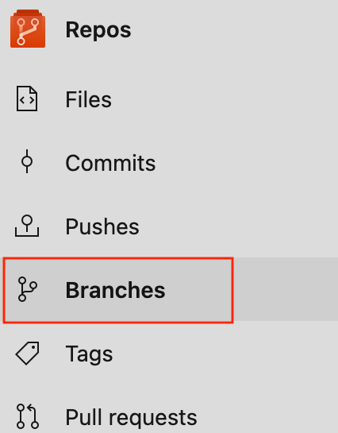
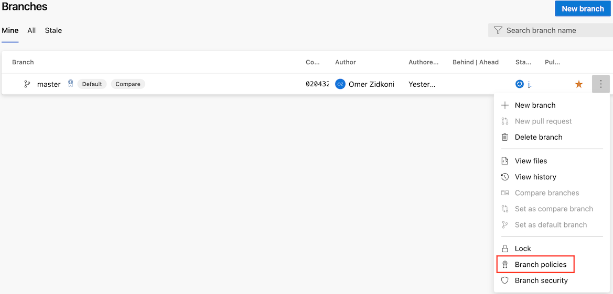
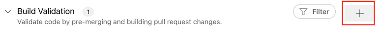
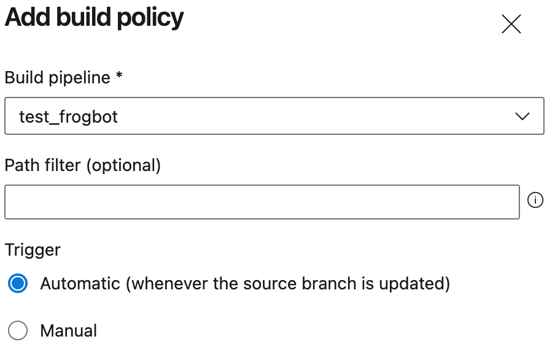

[Go back to the main documentation page](https://github.com/jfrog/frogbot)

# Installing Frogbot on Azure Repos repositories

| Important: Using Frogbot with Azure DevOps isn't recommended for open-source projects. Read more about it in the [Security note for pull requests scanning](../README.md#-security-note-for-pull-requests-scanning) section. |
| -------------------------------------------------------------------------------------------------------------------------------------------------------------------------------------------------------------------- |

To install Frogbot on Azure Repos repositories, follow these steps.

1. Make sure you have the connection details of your JFrog environment.

2. Decide which repository branches you'd like to scan.

3. Go to your Azure Pipelines project, and add a new pipeline.

   

4. Set `Azure Repos Git` as your code source.

   

5. Select the repository in which the Frogbot pipelines will reside in.

   

6. Select `Starter Pipeline` and name it `frogbot`.

   

7. Use the content of the below templates for the pipeline. Edit the remaining mandatory `Variables`.

<details>
   <summary>Scanning repository branches and fixing issues</summary>

 ```yml
schedules:
   - cron: '0 0 * * *'
     displayName: Daily midnight build
     branches:
        include:
           - main

pr: none
trigger: none

pool:
   vmImage: ubuntu-latest

variables:
   # Predefined Azure Pipelines variables. There's no need to modify them.
   JF_GIT_PROJECT: $(System.TeamProject)
   JF_GIT_REPO: $(Build.Repository.Name)
   JF_GIT_API_ENDPOINT: $(System.CollectionUri)
   JF_GIT_BASE_BRANCH: $(Build.SourceBranchName)
   JF_GIT_OWNER: $(System.TeamProject)
   JF_GIT_PROVIDER: 'azureRepos'

jobs:
   - job:
     displayName: "Frogbot Scan Repository and Fix"
     steps:
        - task: CmdLine@2
          displayName: 'Download and Run Frogbot'
          env:
             # [Mandatory]
             # JFrog platform URL (This functionality requires version 3.29.0 or above of Xray)
             JF_URL: $(JF_URL)

             # [Mandatory if JF_USER and JF_PASSWORD are not provided]
             # JFrog access token with 'read' permissions for Xray
             JF_ACCESS_TOKEN: $(JF_ACCESS_TOKEN)

             # [Mandatory if JF_ACCESS_TOKEN is not provided]
             # JFrog user and password with 'read' permissions for Xray
             # JF_USER: $JF_USER
             # JF_PASSWORD: $JF_PASSWORD

             # [Mandatory]
             # Azure Repos personal access token with Code -> Read & Write permissions
             JF_GIT_TOKEN: $(JF_GIT_TOKEN)

             # [Optional]
             # By default, the Frogbot workflows download the Frogbot executable as well as other tools 
             # needed from https://releases.jfrog.io
             # If the machine that runs Frogbot has no access to the internet, follow these steps to allow the
             # executable to be downloaded from an Artifactory instance, which the machine has access to: 
             #
             # 1. Login to the Artifactory UI, with a user who has admin credentials.
             # 2. Create a Remote Repository with the following properties set.
             #    Under the 'Basic' tab:
             #       Package Type: Generic
             #       URL: https://releases.jfrog.io
             #    Under the 'Advanced' tab:
             #       Uncheck the 'Store Artifacts Locally' option
             # 3. Set the value of the 'JF_RELEASES_REPO' variable with the Repository Key you created.
             # JF_RELEASES_REPO: ""

             ###########################################################################
             ##   If your project uses a 'frogbot-config.yml' file, you should define ##
             ##   the following variables inside the file, instead of here.           ##
             ###########################################################################

             # [Mandatory if the two conditions below are met]
             # 1. The project uses yarn 2, NuGet, or .NET to download its dependencies
             # 2. The `installCommand` variable isn't set in your frogbot-config.yml file.
             #
             # The command that installs the project dependencies (e.g "nuget restore")
             # JF_INSTALL_DEPS_CMD: ""

             # [Optional, default: "."]
             # Relative path to the root of the project in the Git repository
             # JF_WORKING_DIR: maven

             # [Optional]
             # Xray Watches. Learn more about them here: https://www.jfrog.com/confluence/display/JFROG/Configuring+Xray+Watches
             # JF_WATCHES: <watch-1>,<watch-2>...<watch-n>

             # [Optional]
             # JFrog project. Learn more about it here: https://www.jfrog.com/confluence/display/JFROG/Projects
             # JF_PROJECT: <project-key>

             # [Optional, default: "FALSE"]
             # Displays all existing vulnerabilities, including the ones that were added by the pull request.
             # JF_INCLUDE_ALL_VULNERABILITIES: "TRUE"

             # [Optional, default: "TRUE"]
             # Fails the Frogbot task if any security issue is found.
             # JF_FAIL: "FALSE"

             # [Optional]
             # Relative path to a Pip requirements.txt file. If not set, the Python project's dependencies are determined and scanned using the project setup.py file.
             # JF_REQUIREMENTS_FILE: ""

             # [Optional, Default: "TRUE"]
             # Use Gradle wrapper.
             # JF_USE_WRAPPER: "FALSE"

             # [Optional]
             # Frogbot will download the project dependencies if they're not cached locally. To download the
             # dependencies from a virtual repository in Artifactory, set the name of the repository. There's no
             # need to set this value, if it is set in the frogbot-config.yml file.
             # JF_DEPS_REPO: ""

             # [Optional]
             # Template for the branch name generated by Frogbot when creating pull requests with fixes.
             # The template must include {BRANCH_NAME_HASH}, to ensure that the generated branch name is unique.
             # The template can optionally include the {IMPACTED_PACKAGE} and {FIX_VERSION} variables.
             # JF_BRANCH_NAME_TEMPLATE: "frogbot-{IMPACTED_PACKAGE}-{BRANCH_NAME_HASH}"

             # [Optional]
             # Template for the commit message generated by Frogbot when creating pull requests with fixes
             # The template can optionally include the {IMPACTED_PACKAGE} and {FIX_VERSION} variables.
             # JF_COMMIT_MESSAGE_TEMPLATE: "Upgrade {IMPACTED_PACKAGE} to {FIX_VERSION}"

             # [Optional]
             # Template for the pull request title generated by Frogbot when creating pull requests with fixes.
             # The template can optionally include the {IMPACTED_PACKAGE} and {FIX_VERSION} variables.
             # JF_PULL_REQUEST_TITLE_TEMPLATE: "[🐸 Frogbot] Upgrade {IMPACTED_PACKAGE} to {FIX_VERSION}"

             # [Optional, Default: "FALSE"]
             # If TRUE, Frogbot creates a single pull request with all the fixes.
             # If FALSE, Frogbot creates a separate pull request for each fix.
             # JF_GIT_AGGREGATE_FIXES: "FALSE"

             # [Optional, Default: "FALSE"]
             # Handle vulnerabilities with fix versions only
             # JF_FIXABLE_ONLY: "TRUE"

             # [Optional]
             # Set the minimum severity for vulnerabilities that should be fixed and commented on in pull requests
             # The following values are accepted: Low, Medium, High, or Critical
             # JF_MIN_SEVERITY: ""

             # [Optional, Default: eco-system+frogbot@jfrog.com]
             # Set the email of the commit author
             # JF_GIT_EMAIL_AUTHOR: ""

          inputs:
             script: |
                getFrogbotScriptPath=$(if [ -z "$JF_RELEASES_REPO" ]; then echo "https://releases.jfrog.io"; else echo "${JF_URL}/artifactory/${JF_RELEASES_REPO}"; fi)
                curl -fLg "$getFrogbotScriptPath/artifactory/frogbot/v2/[RELEASE]/getFrogbot.sh" | sh
                ./frogbot cfpr
 ```

</details>

<details>
   <summary>Scanning pull requests</summary>

 ```yml
pool:
   vmImage: ubuntu-latest

trigger: none

variables:
   JF_GIT_PULL_REQUEST_ID: $(System.PullRequest.PullRequestId)
   JF_GIT_PROJECT: $(System.TeamProject)
   JF_GIT_REPO: $(Build.Repository.Name)
   JF_GIT_API_ENDPOINT: $(System.CollectionUri)
   JF_GIT_BASE_BRANCH: $(System.PullRequest.TargetBranch)
   JF_GIT_OWNER: $(System.TeamProject)
   JF_GIT_PROVIDER: 'azureRepos'

jobs:
   - job:
     displayName: "Frogbot Scan Pull Request"
     steps:
        - task: CmdLine@2
          displayName: 'Download and Run Frogbot'
          env:
            # [Mandatory]
            # JFrog platform URL (This functionality requires version 3.29.0 or above of Xray)
            JF_URL: $(JF_URL)
  
            # [Mandatory if JF_USER and JF_PASSWORD are not provided]
            # JFrog access token with 'read' permissions for Xray
            JF_ACCESS_TOKEN: $(JF_ACCESS_TOKEN)
  
            # [Mandatory if JF_ACCESS_TOKEN is not provided]
            # JFrog user and password with 'read' permissions for Xray
            # JF_USER: $JF_USER
            # JF_PASSWORD: $JF_PASSWORD
  
            # [Mandatory]
            # Azure Repos personal access token with Code -> Read & Write permissions
            JF_GIT_TOKEN: $(JF_GIT_TOKEN)
  
            # [Optional]
            # By default, the Frogbot workflows download the Frogbot executable as well as other tools 
            # needed from https://releases.jfrog.io
            # If the machine that runs Frogbot has no access to the internet, follow these steps to allow the
            # executable to be downloaded from an Artifactory instance, which the machine has access to: 
            #
            # 1. Login to the Artifactory UI, with a user who has admin credentials.
            # 2. Create a Remote Repository with the following properties set.
            #    Under the 'Basic' tab:
            #       Package Type: Generic
            #       URL: https://releases.jfrog.io
            #    Under the 'Advanced' tab:
            #       Uncheck the 'Store Artifacts Locally' option
            # 3. Set the value of the 'JF_RELEASES_REPO' variable with the Repository Key you created.
            # JF_RELEASES_REPO: ""
            
            # [Optional]
            # Configure the SMTP server to enable Frogbot to send emails with detected secrets in pull request scans.
            # SMTP server URL including should the relevant port: (Example: smtp.server.com:8080)
            # JF_SMTP_SERVER: ""
   
            # [Mandatory if JF_SMTP_SERVER is set]
            # The username required for authenticating with the SMTP server.
            # JF_SMTP_USER: ""
   
            # [Mandatory if JF_SMTP_SERVER is set]
            # The password associated with the username required for authentication with the SMTP server.
            # JF_SMTP_PASSWORD: ""

            # [Optional]
            # Configure the SMTP server to enable Frogbot to send emails with detected secrets in pull request scans.
            # SMTP server URL including should the relevant port: (Example: smtp.server.com:8080)
            # JF_SMTP_SERVER: ""

            # [Mandatory if JF_SMTP_SERVER is set]
            # The username required for authenticating with the SMTP server.
            # JF_SMTP_USER: ""

            # [Mandatory if JF_SMTP_SERVER is set]
            # The password associated with the username required for authentication with the SMTP server.
            # JF_SMTP_PASSWORD: ""
  
            ###########################################################################
            ##   If your project uses a 'frogbot-config.yml' file, you should define ##
            ##   the following variables inside the file, instead of here.           ##
            ###########################################################################

            # [Optional, default: "."]
            # Relative path to the root of the project in the Git repository
            # JF_WORKING_DIR: path/to/project/dir
  
            # [Optional]
            # Xray Watches. Learn more about them here: https://www.jfrog.com/confluence/display/JFROG/Configuring+Xray+Watches
            # JF_WATCHES: <watch-1>,<watch-2>...<watch-n>
  
            # [Optional]
            # JFrog project. Learn more about it here: https://www.jfrog.com/confluence/display/JFROG/Projects
            # JF_PROJECT: <project-key>
  
            # [Optional, default: "FALSE"]
            # Displays all existing vulnerabilities, including the ones that were added by the pull request.
            # JF_INCLUDE_ALL_VULNERABILITIES: "TRUE"
  
            # [Optional, default: "TRUE"]
            # Fails the Frogbot task if any security issue is found.
            # JF_FAIL: "FALSE"
  
            # [Optional]
            # Frogbot will download the project dependencies if they're not cached locally. To download the
            # dependencies from a virtual repository in Artifactory, set the name of the repository. There's no
            # need to set this value, if it is set in the frogbot-config.yml file.
            # JF_DEPS_REPO: ""
            
            # [Optional, Default: "FALSE"]
            # Handle vulnerabilities with fix versions only
            # JF_FIXABLE_ONLY: "TRUE"
  
            # [Optional]
            # Set the minimum severity for vulnerabilities that should be fixed and commented on in pull requests
            # The following values are accepted: Low, Medium, High or Critical
            # JF_MIN_SEVERITY: ""
  
            # [Optional]
            # List of comma separated email addresses to receive email notifications about secrets
            # detected during pull request scanning. The notification is also sent to the email set
            # in the committer git profile regardless of whether this variable is set or not.
            # JF_EMAIL_RECEIVERS: ""
            
            # [Optional]
            # Set the list of allowed licenses
            # The full list of licenses can be found in:
            # https://github.com/jfrog/frogbot/blob/master/docs/licenses.md
            # JF_ALLOWED_LICENSES: "MIT, Apache-2.0"
  
          inputs:
             script: |
                getFrogbotScriptPath=$(if [ -z "$JF_RELEASES_REPO" ]; then echo "https://releases.jfrog.io"; else echo "${JF_URL}/artifactory/${JF_RELEASES_REPO}"; fi)
                curl -fLg "$getFrogbotScriptPath/artifactory/frogbot/v2/[RELEASE]/getFrogbot.sh" | sh
                ./frogbot spr
 ```

> **_NOTE:_** To set up a pull request trigger in Azure Repos, you need to add a branch policy via 'Branch Policies'.

- Go to the "Branches" section:

   

- For each of the branches against which you want Frogbot to scan pull requests, click on the three dots and select "Branch policies":

   

- Add new build policy:

   

- Fill the following build policy parameters and Save:

   

</details>


8. For the pipeline you created, save the JFrog connection details as variables with the following names - JF_URL, JF_USER, and JF_PASSWORD.

   > **_NOTE:_** You can also use **JF_XRAY_URL** and **JF_ARTIFACTORY_URL** instead of **JF_URL**, and **JF_ACCESS_TOKEN**
   > instead of **JF_USER** and **JF_PASSWORD**.

   To set the `Variables` in the pipeline edit page, click on the `Variables` button and set the `Variables`.

   

   
