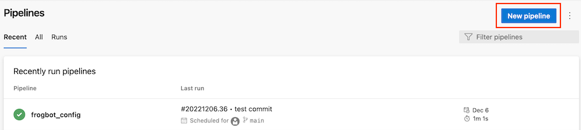
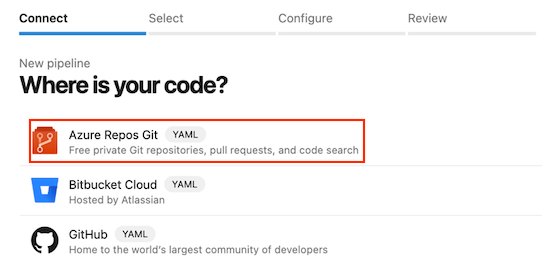
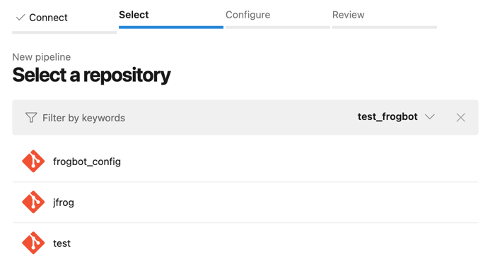
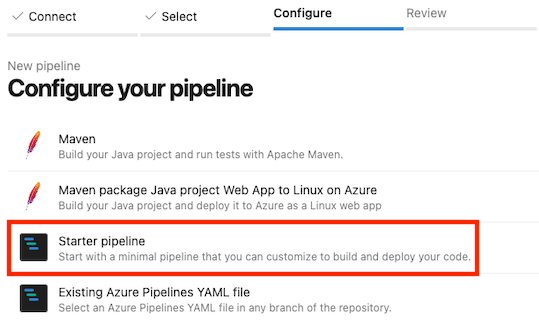

[Go back to the main documentation page](https://github.com/jfrog/frogbot)

# Installing Frogbot on Azure Repos repositories

| Important: Using Frogbot with Azure DevOps isn't recommended for open source projects. Read more about it in the [Security note for pull requests scanning](../README.md#-security-note-for-pull-requests-scanning) section. |
| -------------------------------------------------------------------------------------------------------------------------------------------------------------------------------------------------------------------- |

To install Frogbot on Azure Repos repositories, follow these steps.

1. Make sure you have the connection details of your JFrog environment.

2. Decide which repository branches you'd like to scan.

3. Go to your Azure Pipelines project, and add a new pipeline.

   

4. Set `Azure Repos Git` as your code source.

   

5. Select your `Frogbot Management Repository`.

   

6. Select `Starter Pipeline` and name it `frogbot`.

   

7. Use the content of the below template for the pipeline. Edit the remaining mandatory `Variables`.

<details>
   <summary>Template</summary>

 ```yml
  schedules:
       # Run once an hour
       - cron: "* */1 * * *"
         branches: 
           include: 
             - "main"
             - "master"
  pool:
       vmImage: ubuntu-latest
       
  variables:
     # Predefined Azure Pipelines variables. There's no need to modify them.
     JF_GIT_PROJECT: $(System.TeamProject)
     JF_GIT_API_ENDPOINT: $(System.CollectionUri)
     JF_GIT_PROVIDER: 'azureRepos'

  jobs:
     - job:
       displayName: "Frogbot Scan"
       steps:
       - task: CmdLine@2
         env:
            # Predefined Azure Pipelines variables. There's no need to modify them.
            JF_GIT_PROJECT: $(System.TeamProject)
            JF_GIT_API_ENDPOINT: $(System.CollectionUri)
            JF_GIT_PROVIDER: 'azureRepos'

            # [Mandatory]
            # Azure Repos personal access token with Code -> Read & Write permissions
            JF_GIT_TOKEN: $(FROGBOT_GIT_TOKEN)

            # [Mandatory]
            # JFrog platform URL (This functionality requires version 3.29.0 or above of Xray)
            JF_URL: $(JF_URL)

            # [Mandatory if JF_USER and JF_PASSWORD are not provided]
            # JFrog access token with 'read' permissions for Xray
            JF_ACCESS_TOKEN: $(JF_ACCESS_TOKEN)

            # [Mandatory if JF_ACCESS_TOKEN is not provided]
            # JFrog user and password with 'read' permissions for Xray
            # JF_USER: $(JF_USER)
            # JF_PASSWORD: $(JF_PASSWORD)

            # [Mandatory]
            # The name of the organization that owns this project
            JF_GIT_OWNER: ""

            # [Optional]
            # If the machine that runs Frogbot has no access to the internet, set the name of a remote repository 
            # in Artifactory, which proxies https://releases.jfrog.io
            # The 'frogbot' executable and other tools it needs will be downloaded through this repository.
            # JF_RELEASES_REPO: ""

            ##########################################################################
            ##   If your project uses a 'frogbot-config.yml' file, you can define   ##
            ##   the following variables inside the file, instead of here.          ##
            ##########################################################################

            # [Mandatory]
            # The name of the repository
            JF_GIT_REPO: "multi_example_project"

            # [Mandatory]
            # The name of the branch on which Frogbot will perform the scan
            JF_GIT_BASE_BRANCH: "main"

            # [Mandatory if the two conditions below are met]
            # 1. The project uses yarn 2, NuGet or .NET to download its dependencies
            # 2. The `installCommand` variable isn't set in your frogbot-config.yml file.
            #
            # The command that installs the project dependencies (e.g "nuget restore")
            JF_INSTALL_DEPS_CMD: ""

            # [Optional, default: "."]
            # Relative path to the root of the project in the Git repository
            # JF_WORKING_DIR: path/to/project/dir

            # [Optional]
            # Xray Watches. Learn more about them here: https://www.jfrog.com/confluence/display/JFROG/Configuring+Xray+Watches
            # JF_WATCHES: <watch-1>,<watch-2>...<watch-n>

            # [Optional]
            # JFrog project. Learn more about it here: https://www.jfrog.com/confluence/display/JFROG/Projects
            # JF_PROJECT: <project-key>

            # [Optional, default: "FALSE"]
            # Displays all existing vulnerabilities, including the ones that were added by the pull request.
            # JF_INCLUDE_ALL_VULNERABILITIES: "TRUE"

            # [Optional, default: "TRUE"]
            # Fails the Frogbot task if any security issue is found.
            # JF_FAIL: "FALSE"

            # [Optional]
            # Relative path to a Pip requirements.txt file. If not set, the python project's dependencies are determined and scanned using the project setup.py file.
            # JF_REQUIREMENTS_FILE: ""

            # [Optional, Default: "TRUE"]
            # Use Gradle wrapper.
            # JF_USE_WRAPPER: "FALSE"

            # [Optional]
            # Frogbot will download the project dependencies if they're not cached locally. To download the
            # dependencies from a virtual repository in Artifactory, set the name of of the repository. There's no
            # need to set this value, if it is set in the frogbot-config.yml file.
            # JF_DEPS_REPO: ""

            # [Optional]
            # Template for the branch name generated by Frogbot when creating pull requests with fixes.
            # The template must include ${BRANCH_NAME_HASH}, to ensure that the generated branch name is unique.
            # The template can optionally include the ${IMPACTED_PACKAGE} and ${FIX_VERSION} variables.
            # JF_BRANCH_NAME_TEMPLATE: "frogbot-${IMPACTED_PACKAGE}-${BRANCH_NAME_HASH}"

            # [Optional]
            # Template for the commit message generated by Frogbot when creating pull requests with fixes
            # The template can optionally include the ${IMPACTED_PACKAGE} and ${FIX_VERSION} variables.
            # JF_COMMIT_MESSAGE_TEMPLATE: "Upgrade ${IMPACTED_PACKAGE} to ${FIX_VERSION}"

            # [Optional]
            # Template for the pull request title generated by Frogbot when creating pull requests with fixes.
            # The template can optionally include the ${IMPACTED_PACKAGE} and ${FIX_VERSION} variables.
            # JF_PULL_REQUEST_TITLE_TEMPLATE: "[🐸 Frogbot] Upgrade ${IMPACTED_PACKAGE} to ${FIX_VERSION}"

            # [Optional, Default: "FALSE"]
            # If TRUE, Frogbot creates a single pull request with all the fixes.
            # If FALSE, Frogbot creates a separate pull request for each fix.
            # JF_GIT_AGGREGATE_FIXES: "FALSE"

            # [Optional, Default: "FALSE"]
            # Handle vulnerabilities with fix versions only
            # JF_FIXABLE_ONLY: "TRUE"

            # [Optional]
            # Set the minimum severity for vulnerabilities that should be fixed and commented on in pull requests
            # The following values are accepted: Low, Medium, High or Critical
            # JF_MIN_SEVERITY: ""

            # [Optional, Default: eco-system+frogbot@jfrog.com]
            # Set the email of the commit author
            # JF_GIT_EMAIL_AUTHOR: ""
         displayName: 'Download and Run Frogbot'   
         inputs:
           script: |
              getFrogbotScriptPath=$( [[ -z "$JF_RELEASES_REPO" ]] && echo "https://releases.jfrog.io" || echo "${JF_URL}/artifactory/${JF_RELEASES_REPO}" )
              curl -fLg "$getFrogbotScriptPath/artifactory/frogbot/v2/[RELEASE]/getFrogbot.sh" | sh
              ./frogbot scan-pull-requests
              ./frogbot scan-and-fix-repos
 ```

</details>

8. For the pipeline you created, save the JFrog connection details as variables with the following names - JF_URL, JF_USER, and JF_PASSWORD.

   > **_NOTE:_** You can also use **JF_XRAY_URL** and **JF_ARTIFACTORY_URL** instead of **JF_URL**, and **JF_ACCESS_TOKEN**
   > instead of **JF_USER** and **JF_PASSWORD**.

   To set the `Variables` in the pipeline edit page, click on the `Variables` button and set the `Variables`.

   

   
