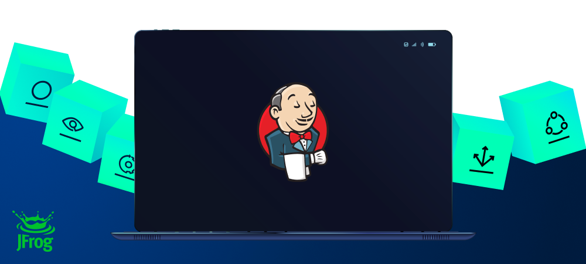
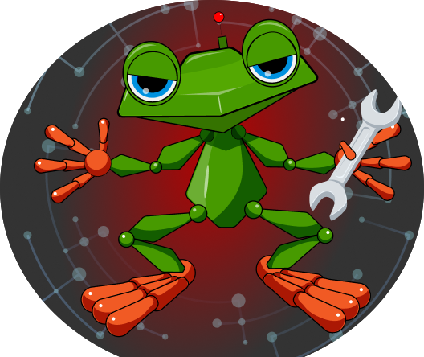
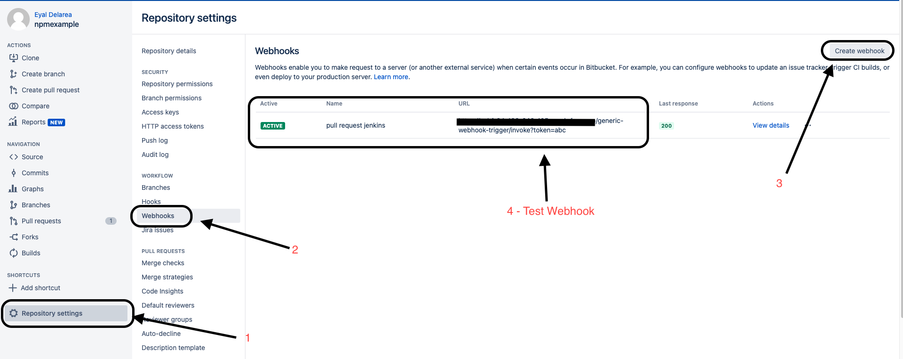
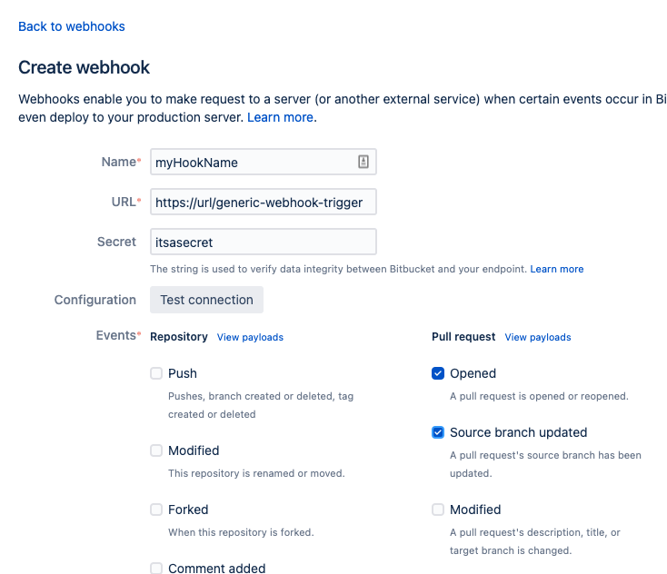
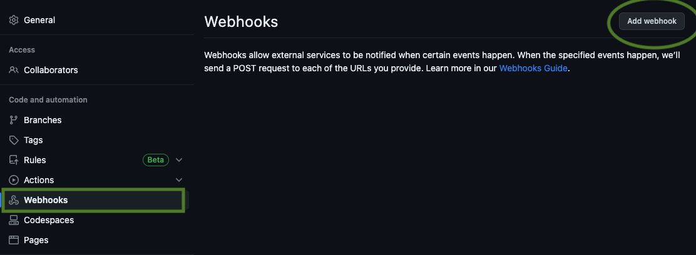
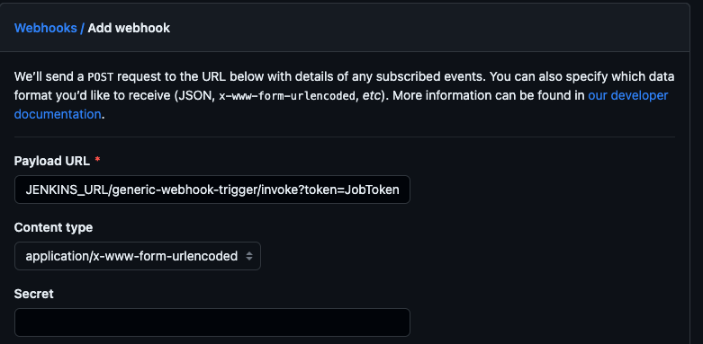
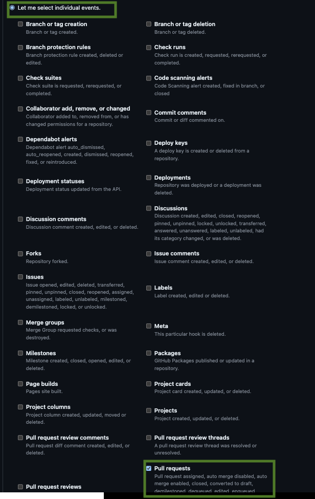
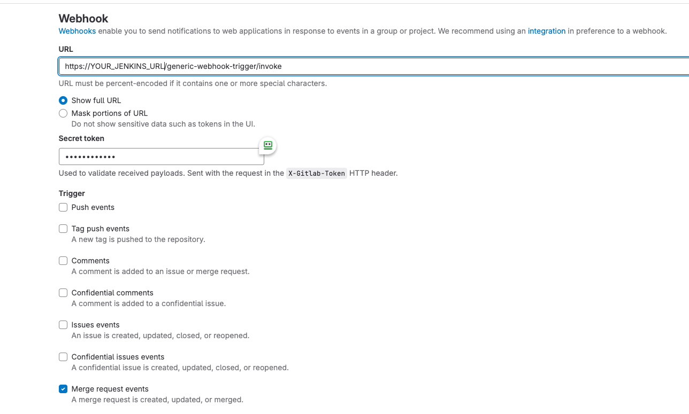
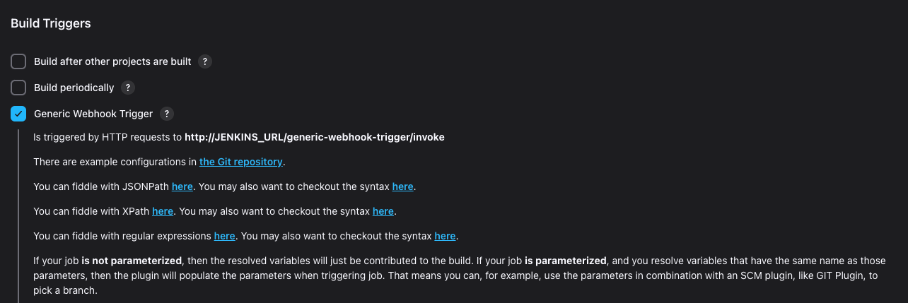

[Go back to the Installation documentation page](../../../README.md)

# Set up Frogbot Using Jenkins

### 🖥️ Follow These steps to install Frogbot on Jenkins

  
1️⃣  Install Jenkins Webhook Plugin 

- **Install Generic Webhook Trigger**
    - Using the GUI: From your Jenkins dashboard navigate to Manage Jenkins > Manage Plugins and select the Available
      tab. Locate this plugin by searching
      for - [Generic Webhook Trigger](https://plugins.jenkins.io/generic-webhook-trigger/).

  
2️⃣ Set up Webhook on your Git Provider 

- Webhook Link: `JENKINS_URL/generic-webhook-trigger/invoke`
- Optional - **JobToken** : When using the plugin in several jobs, you will have the same URL trigger all jobs. If you
  want to trigger only a certain job you can use the **JobToken** in the URL to specify what job needs to be executed.
- Webhook Link with **JobToken** : `JENKINS_URL/generic-webhook-trigger/invoke?token=JobToken`
- Read more [JobToken Docs](https://plugins.jenkins.io/generic-webhook-trigger/#plugin-content-trigger-only-specific-job)
- 🌟 Choose your Git provider:
    

      
 Bitbucket Server  

    - Go to repository settings and select Webhooks , and create a new webhook.
      
    - Set the webhook URL  `https://jenkinsUrl/generic-webhook-trigger/invoke?token=JobToken`
      

    

  

      
 GitHub  

  
    - Go to repository settings and create a new webhook.
    
  
    - Add a new webhook
    
  
    - Set up trigger
    

  

  

        
 Azure Repos  

    - [Set Up Azure Repos Jenkins Webhook](https://learn.microsoft.com/en-us/azure/devops/service-hooks/services/jenkins?view=azure-devops)

    

  

        
 GitLab  

    - Go your project settings and select webhooks.
    - Setup a webhook with merge request events
    - **Secret Token** is the JobToken to execute a specific job, this is optional.
    -  

    - Fill in your **JENKINS URL/generic-webhook-trigger/invoke** , **SECRET_TOKEN** and select add webhook.

  
3️⃣ Set up credentials

- Make sure you have the connection details of your JFrog environment and saved as credentials, as they will be
  referenced from the Jenkinsfile.
- Set up the following credentials:
    - **JF_URL**
    - **JF_ACCESS_TOKEN** *or* **JF_USER**  & **JF_PASSWORD**
    - **JF_GIT_TOKEN** access token with read&write access to the repository.
- [How to use credentials with Jenkins](https://www.jenkins.io/doc/book/using/using-credentials/)

  
4️⃣  Prepare Agents

- It is necessary to have the package manager corresponding to the repository installed on the machine. For example, for
  an npm project, npm must be installed. In the case of multi-project repositories, ensure that all the required package
  managers are installed

  
5️⃣ Copy templates 

- **Create a new pipeline**
- **Copy and adjust params for each command**

* [Scan And Fix Repository](scan-and-fix.jenkinsfile)

* [Scan Pull Request](scan-pull-request.jenkinsfile)

- For Scan Pull Request, make sure to enable build trigger.

      

